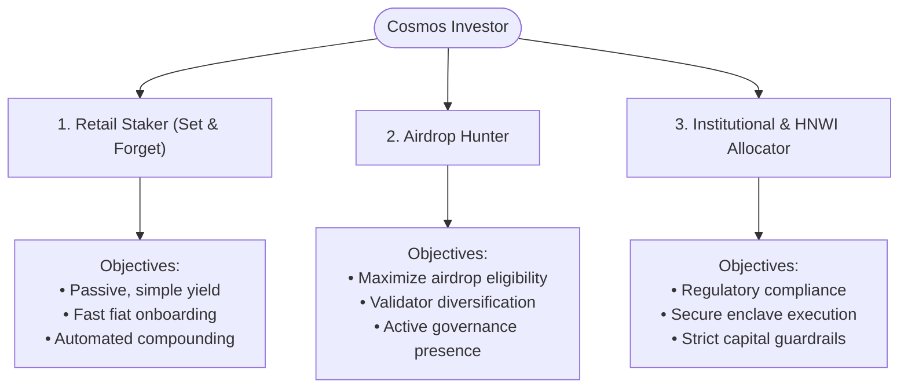

# Stakefolio — User Objectives & Meaningful Solutions

Stakefolio is a next-generation non-custodial liquid staking platform and autonomous assistant for the Cosmos ecosystem. By abstracting the deep technical and operational complexities of multi-chain web3 staking behind a premium, intuitive, and secure interface, Stakefolio addresses the core problems faced by decentralized asset allocators.

This document details the target user profiles, their primary objectives, the barriers they face, and how Stakefolio provides elegant, meaningful, and secure solutions.

---

## 1. Staking Market Friction: The Core Problems

Traditional liquid staking and yield optimization in the Cosmos ecosystem present steep barriers to entry, security risks, and operational overhead:

| Problem Domain | Detailed Pain Point | Impact on Users |
| :--- | :--- | :--- |
| **UX & Cross-Chain Complexity** | Users must navigate multiple networks (Cosmos Hub, Stride, Osmosis), manage multiple native tokens, configure wallet connections, and understand cross-chain IBC transfers just to start earning yield. | **High cognitive load.** Users make errors, lose gas fees, or decide not to participate at all, leaving yield on the table. |
| **Capital Illiquidity** | Traditional native staking locks ATOM for a 21-day unbonding period. Users cannot react to market volatility, adjust allocations, or deploy assets in DeFi protocols. | **Locked capital & opportunity cost.** Users risk holding depreciating assets during downturns. |
| **Validator Risk & Monitoring** | Commission rates fluctuate without warning; validators suffer from downtime or face slashing penalties; delegating to central entities (Top 10 or exchanges) reduces network security and disqualifies users from airdrops. | **Yield degradation & slashing loss.** Users must continuously monitor validator metrics manually or suffer financial penalties. |
| **Compliance & Safety Gaps** | Institutions and High-Net-Worth Individuals (HNWIs) lack mechanisms to guarantee that their staking validators operate within compliant jurisdictions (e.g., SEC/CSA/MiCA compliance) or conform to strict risk tolerances (e.g., maximum daily gas limits, secure sandboxing). | **Regulatory & legal exposure.** Large allocators are barred from participating due to compliance risks. |
| **Missed Staking Incentives** | Liquid stakers often miss out on protocol governance votes (which are highly weighted for rewards/airdrops) or fail to find and claim ecosystem airdrops. | **Sub-optimal performance.** Active participants outperform passive holders by substantial margins. |

---

## 2. Stakefolio's Target Audience & Objectives

Stakefolio segments its solution space into three core user profiles, each with unique staking objectives and operational criteria:



### Profile 1: The Retail Staker ("Set & Forget")
*   **Primary Objective**: Earn consistent, high yield on digital assets with minimal friction and maximum simplicity.
*   **Secondary Objectives**: 
    *   Easily purchase assets using fiat cash.
    *   Maintain liquid assets that can be exited or swapped instantly.
    *   Avoid the overhead of selecting validators, tracking interest rates, and compounding rewards.

### Profile 2: The Airdrop Hunter
*   **Primary Objective**: Maximize exposure to Cosmos ecosystem airdrops and secondary incentive distribution campaigns.
*   **Secondary Objectives**:
    *   Distribute delegations across multiple medium-sized, independent validators (satisfying typical airdrop rules).
    *   Avoid delegating to exchanges or Top-10 dominant validators (which are almost always blacklisted by airdrop creators).
    *   Maintain a high governance voting participation rate through automated proxies.

### Profile 3: The HNWI & Institutional Allocator
*   **Primary Objective**: Participate in high-yield liquid staking while maintaining compliance, security, and tight risk controls.
*   **Secondary Objectives**:
    *   Enforce validator selection based on legal jurisdictions and compliance standards (such as SEC, CSA, and MiCA).
    *   Validate and simulate transactions within a secure local sandbox on the client device before broadcasting.
    *   Impose strict risk limits on daily gas consumption and transaction slippage.

---

## 3. The Stakefolio Solution Suite

Stakefolio resolves these user problems through a cohesive system comprising a premium dashboard, fiat integration, and an intelligent, on-device autonomous staking agent.

```
┌────────────────────────────────────────────────────────────────────────┐
│                        STAKEFOLIO APPLICATION                          │
│                                                                        │
│  ┌───────────────────────┐   ┌──────────────────────────────────────┐  │
│  │     UX DASHBOARD      │   │       ON-DEVICE AUTONOMOUS AGENT     │  │
│  │ 1-Click Fiat On-Ramp  │   │  ┌────────────────────────────────┐  │  │
│  │ Portfolio Composition │ ──┼─>│      Yield Optimizer Engine    │  │  │
│  │ Liquid Asset Swap     │   │  │  - Auto-Compounding & Swaps    │  │  │
│  └───────────────────────┘   │  └────────────────────────────────┘  │  │
│              │               │  ┌────────────────────────────────┐  │  │
│              ▼               │  │     Safety & Compliance Shield  │  │  │
│  ┌───────────────────────┐   │  │  - Slashing & Jurisdiction Vetting│  │  │
│  │   STRIDE LST ROUTER   │   │  └────────────────────────────────┘  │  │
│  │ stATOM / stOSMO / JUNO│   │  ┌────────────────────────────────┐  │  │
│  └───────────────────────┘   │  │       Airdrop & Gov Proxy      │  │  │
│                              │  │  - Decentralized Voting Mode   │  │  │
│                              │  └────────────────────────────────┘  │  │
│                              └──────────────────────────────────────┘  │
└────────────────────────────────────────────────────────────────────────┘
```

### Solution A: Single-Chain Dashboard & Auto-Staking
To remove cross-chain complexity and capital lockup, Stakefolio offers a unified, single-chain experience:
*   **1-Click Fiat Onboarding**: Integrates Transak and Ramp networks directly into the web interface, letting users buy native assets (like ATOM) with fiat currencies (USD, CAD, EUR) instantly.
*   **Instant Liquid Staking**: Automatically converts deposited ATOM into stATOM (Stride Liquid Staked ATOM) behind the scenes. The user starts earning ~8.5% APR immediately, while their capital remains completely liquid.
*   **Visual Asset Allocation**: Provides beautiful, live composition charts and simple swap interfaces to distribute assets across top liquid staking tokens (stATOM, stOSMO, stJUNO, stSTARS, stSCRT) without needing to understand underlying bridge mechanics.

### Solution B: Autonomous Staking Agent
The core product innovation is an **on-device autonomous agent** that automates execution based on the user's specific profile settings:

#### 1. Set-and-Forget Automation
*   **Validator Uptime Vetting**: The agent continuously screens validators and automatically redirects stakes away from underperforming nodes to avoid slashing.
*   **Commission Ceilings**: Users set their maximum commission fee (e.g., 8.0%). The agent filters and blocks delegation proposals to expensive validators.
*   **Auto-Compounding**: Converts and pools yields back into the liquid staking assets dynamically to maximize compound returns.

#### 2. Decentralized Airdrop Shielding
*   **Anti-Centralization Filter**: Automatically splits delegations across independent validators (e.g., splitting a stake among 3 or 4 providers) and avoids exchange-run or top-tier validators.
*   **Governance Proxy Mode**: Automatically participates in governance votes using active user-defined policies. This ensures a consistent, high on-chain activity score, maximizing eligibility for major Cosmos network airdrops.

#### 3. Institutional compliance & Security Sandbox
*   **On-Device Hardware Sandbox**: Transactions are constructed, simulated, and audited entirely inside the client’s local browser context using on-device cryptographic processes—retaining the security profile of hardware wallets.
*   **Regulatory Jurisdictional Gateways**: Evaluates and restricts validator sets based on regulatory constraints. Validators operating out of sanctioned or non-compliant regions are automatically blocked by the policy engine.
*   **Hard Guardrails**: Restricts execution if transaction slippage exceeds custom thresholds (e.g., 0.5%) or daily gas fees exceed budget rules.

---

## 4. Feature-to-Solution Mapping

Below is a detailed layout of how Stakefolio features directly target and resolve user problems:

| Platform Feature | Targeted Problem | How it Solves It | Target Persona |
| :--- | :--- | :--- | :--- |
| **Transak & Ramp Integration** | onboarding friction, bank transfers | Direct fiat-to-staking flow without intermediate exchange steps. | Retail |
| **Stride LST Swap Router** | 21-day unbonding locks capital | Staking assets are converted to liquid tokens instantly tradable in DeFi. | Retail, HNWI |
| **Uptime Vetting & Alerting** | Slashing, server downtime loss | Continuous on-chain ping checks and automated validator switching. | Retail, HNWI |
| **Top-10 & Exchange Filter** | Airdrop exclusion, centralization | Blocks delegations to central operators, maintaining decentralized staking. | Airdrop Hunter |
| **Multi-Validator Splitter** | Low airdrop weights, single-point-of-failure | Programmatic distribution of deposits across 3+ vetted validators. | Airdrop Hunter |
| **Gov Proxy Policy Engine** | Inactive voting score, lost voting power | Auto-voter engine casts ballots on behalf of the delegator to show activity. | Airdrop Hunter |
| **Jurisdiction Filtering Shield** | Legal non-compliance, regulatory liability | Evaluates validator entities against SEC/CSA/MiCA geolocations and rules. | Institutional / HNWI |
| **Local Simulation Console** | Blind transaction signing risk | Runs and tests transactions in an isolated local simulator before broadcasting. | Institutional / HNWI |

---

## 5. Summary of Product Impact

Stakefolio transforms staking from a tedious, risk-laden manual process into a secure, passive, and optimized experience. 

> [!IMPORTANT]
> **Key Value Proposition: Custody is Never Sacrificed**
> Unlike traditional centralized yield aggregators, Stakefolio's Autonomous Agent operates directly in the user's browser, communicating with their self-custody wallet (e.g., Keplr, Leap). At no point does the application hold or manage user keys, ensuring absolute custody is maintained at all times.

By offering custom risk/reward modes (Retail, Airdrop Hunter, and Institution), the platform provides tailored solutions that address the specific problems of different segments of the Web3 economy.
